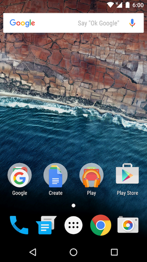
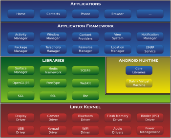

## Android维基百科
```
Android（读音：英：['ændrɔɪd]，美：[ˈænˌdrɔɪd]），中文俗称安卓或安致，是一个基于Linux内核的开放移动操作系统，由Google成立的Open Handset Alliance（OHA，开放手持设备联盟）持续领导与开发，主要设计用于触屏移动设备如智能手机和平板电脑。

Android最初由安迪·鲁宾（Andy Rubin）等人开发制作[6]，最初开发这个系统的目的是创建一个数码相机的先进操作系统；但是后来发现市场需求不够大，加上智能手机市场快速成长，于是Android被改造为一款面向智能手机的操作系统。于2005年7月11日被美国科技企业Google收购[7] [8]。2007年11月，Google与84家硬件制造商、软件开发商及电信营运商成立开放手持设备联盟来共同研发改良Android，随后，Google以Apache免费开放源代码许可证的授权方式，发布了Android的源代码[9]，让生产商推出搭载Android的智能手机[10][11][12][13]，Android后来更逐渐拓展到平板电脑及其他领域上[14]。

2010年末数据显示，仅正式推出两年的Android操作系统在市场占有率上已经超越称霸逾十年的诺基亚Symbian系统[15][16]，成为全球第一大智能手机操作系统[17]。

在2014年Google I/O开发者大会上Google宣布过去30天里有10亿台活跃的安卓设备，相较于2013年6月则是5.38亿[18]。

```
## Android 6.0

## 架构


- [Android官网](https://www.android.com/)
- [安卓开发者官网](https://developer.android.com/index.html)
- [Android wikipedia](https://zh.wikipedia.org/wiki/Android)
