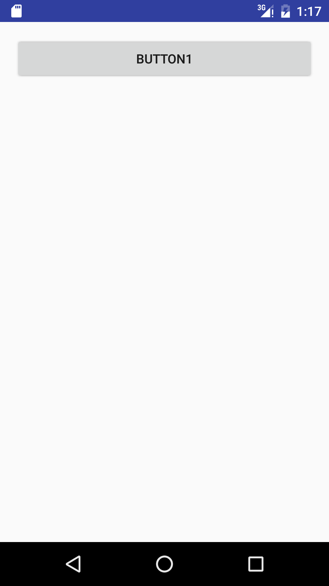
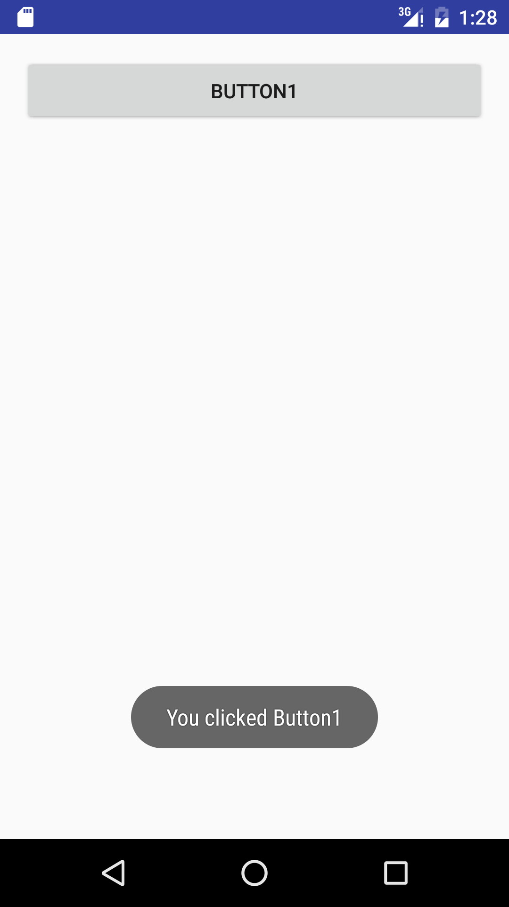

# 活动（Activity）
活动（Activity）是最容易吸引到用户的地方了，它是一种可以包含用户界面的组件，
主要用于和用户进行交互。一个应用程序中可以包含零个或多个活动。

## 创建一个活动
```java
public class FirstActivity extends Activity {

    @Override
    protected void onCreate(Bundle savedInstanceState) {
        super.onCreate(savedInstanceState);
        setContentView(R.layout.activity_first);
    }
}
```
## 注册活动
- AndroidManifest文件中注册
```xml
<activity android:name=".activity.FirstActivity">
     <intent-filter>
         <action android:name="android.intent.action.MAIN" />
         <category android:name="android.intent.category.LAUNCHER" />
     </intent-filter>
 </activity>
```

## 隐藏标题栏
```java
@Override
    protected void onCreate(Bundle savedInstanceState) {
        super.onCreate(savedInstanceState);
        // 隐藏标题栏,必须在setContentView前
        requestWindowFeature(Window.FEATURE_NO_TITLE);
        setContentView(R.layout.activity_first);
    }
```

如果 `requestWindowFeature(Window.FEATURE_NO_TITLE);`没有效果，将extends xxxxActivity 改为 extends Activity
## 在活动中使用Toast
覆写onClick方法
```java
Button button1 = (Button) findViewById(R.id.button_1);
     button1.setOnClickListener(new View.OnClickListener() {
         @Override
         public void onClick(View v) {
             Toast.makeText(FirstActivity.this, "You clicked Button1", Toast.LENGTH_SHORT).show();
         }
     });
```

