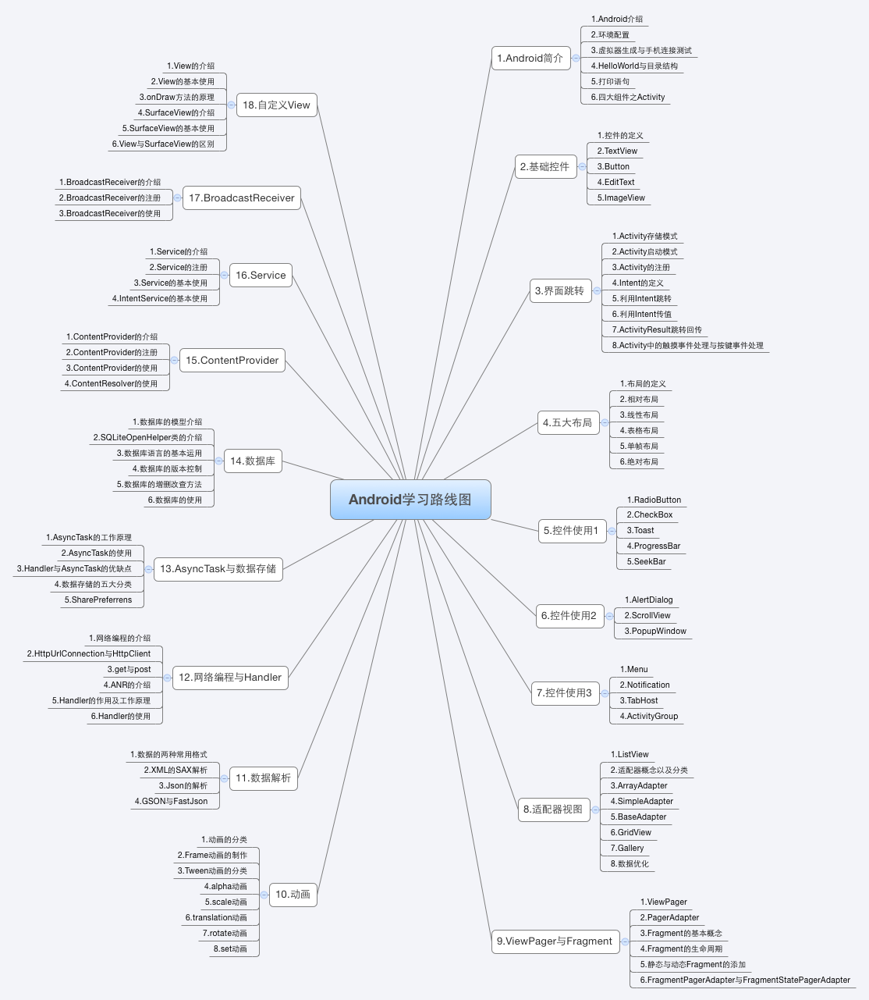

# 安卓学习路线

## Android简介
- Android介绍
- 环境配置
- 虚拟器生成与手机连接测试
- HelloWorld与目录结构
- 打印语句
- 四大组件之Activity

## 基础控件
- 控件的定义
- TextView
- Button
- EditText
- ImageView

## 界面跳转
- Activity存储模式
- Activity启动模式
- Activity的注册
- Intent的定义
- 利用Intent跳转
- 利用Intent传值
- ActivityResult跳转回传
- Activity中的触摸事件处理与按键事件处理

## 五大布局
- 布局的定义
- 相对布局
- 线性布局
- 表格布局
- 单帧布局
- 绝对布局

## 控件使用1
- RadioButton
- CheckBox
- Toast
- ProgressBar
- SeekBar

## 控件使用2
- AlertDialog
- ScrollView
- PopupWindow

## 控件使用3
- Menu
- Notification
- TabHost
- ActivityGroup

## 适配器视图
- ListView
- 适配器概念以及分类
- ArrayAdapter
- SimpleAdapter
- BaseAdapter
- GridView
- Gallery
- 数据优化

## ViewPager与Fragment
- ViewPager
- PagerAdapter
- Fragment的基本概念
- Fragment的生命周期
- 静态与动态Fragment的添加
- FragmentPagerAdapter与FragmentStatePagerAdapter

## 动画
- 动画的分类
- Frame动画的制作
- Tween动画的分类
- alpha动画
- scale动画
- translation动画
- rotate动画
- set动画

## 数据解析
- 数据的两种常用格式
- XML的SAX解析
- Json的解析
- GSON与FastJson

## 网络编程与Handler
- 网络编程的介绍
- HttpUrlConnection与HttpClient
- get与post
- ANR的介绍
- Handler的作用及工作原理
- Handler的使用

## AsyncTask与数据存储
- AsyncTask的工作原理
- AsyncTask的使用
- Handler与AsyncTask的优缺点
- 数据存储的五大分类
- SharedPreferences

## 数据库
- 数据库的模型介绍
- SQLiteOpenHelper类的介绍
- 数据库语言的基本运用
- 数据库的版本控制
- 数据库的增删改查方法
- 数据库的使用

## ContentProvider
- ContentProvider的介绍
- ContentProvider的注册
- ContentProvider的使用
- ContentResolver的使用

## Service
- Service的介绍
- Service的注册
- Service的基本使用
- IntentService的基本使用

## BroadcastReceiver
- BroadcastReceiver的介绍
- BroadcastReceiver的注册
- BroadcastReceiver的使用

## 自定义View
- View的介绍
- View的基本使用
- onDraw方法的原理
- SurfaceView的介绍
- SurfaceView的基本使用
- View与SurfaceView的区别
